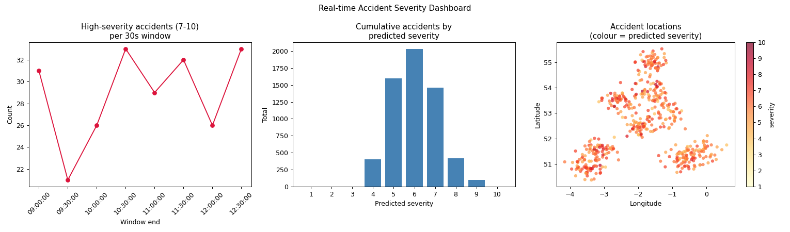

# Real-Time Traffic Severity Streaming Pipeline

[](https://github.com/yujieh00/realtime-traffic-severity-pipeline/actions/workflows/ci.yml)


An end-to-end streaming machine-learning pipeline that predicts road-accident
**severity in real time**. Accidents flow in through **Apache Kafka**, a
**Spark Structured Streaming** job scores each one with a trained **Spark MLlib**
model and aggregates the results in event-time windows, and a live dashboard
visualises the stream as it happens.

Built to demonstrate data-engineering skills end to end: ingestion, stateful
stream processing, ML inference in a streaming context, and durable output.

> **Runs out of the box.** A small synthetic sample dataset (UK STATS19 schema)
> ships with the repo, so you can `docker compose up` and see the whole pipeline
> work in a few minutes — no large downloads.



*Live dashboard: high-severity accidents per 30s window, cumulative counts by
predicted severity, and accident locations coloured by predicted severity
(rendered from real model output on the bundled sample).*

---

## Problem

Emergency dispatchers need to prioritise incidents the moment they are reported.
This project frames that as a streaming regression problem: given the
circumstances of a collision (road, lighting, weather, speed limit, vehicles
involved), predict a **continuous severity score from 1 to 10** as each accident
arrives, and surface the high-severity ones immediately.

## Architecture


```
producer  ──JSON──▶  Kafka(accident_stream)  ──▶  Spark Structured Streaming
                                                     │  watermark 30s
                                                     │  stream-static join
                                                     │  MLlib model.transform
                                                     │  tumbling windows
                                                     ▼
                        Kafka(result topics) + Parquet  ──▶  live dashboard
```

Full diagram (Mermaid) and design notes: [`docs/architecture.md`](docs/architecture.md).

## Tech stack

| Layer | Technology |
|-------|-----------|
| Ingestion | **Apache Kafka** (KRaft, via docker-compose) |
| Stream processing | **Spark Structured Streaming** — event-time watermarking, tumbling windows, stream-static joins |
| Machine learning | **Spark MLlib** — `RandomForestRegressor` vs `GBTRegressor`, `Pipeline`, `CrossValidator` + `ParamGridBuilder`, model persistence |
| Storage | **Parquet** streaming sink |
| Dashboard | Kafka consumer + **matplotlib** (line, bar, bubble-map) |
| Infra | **Docker** + docker-compose (Kafka + full pipeline) |
| Quality | **pytest**, **ruff**, **GitHub Actions** CI, data-quality checks |
| Language | **Python 3.10+** |

## Data

Schema of the public **UK STATS19** road-safety dataset (Department for
Transport, Open Government Licence v3.0). A small, fully-synthetic sample ships
in [`data/sample/`](data/sample/) so the pipeline runs immediately; the full
real dataset is documented but git-ignored. See
[`data/sample/README.md`](data/sample/README.md) for the source and how the
`severity_score` target is derived.

## How to run

Prerequisites: Docker, Python 3.10+, Java 11+ (for Spark).

### Option A — everything in Docker (simplest)

```bash
docker compose build              # build the app image
docker compose run --rm trainer   # generate sample data + train the model
docker compose up -d kafka producer streaming dashboard
docker compose logs -f streaming  # watch predictions stream by
```

The dashboard runs headless and refreshes `output/dashboard.png`. Stop with
`docker compose down`. (A `Makefile` wraps these: `make docker-train`, `make docker-up`.)

### Option B — scripts on your machine, Kafka in Docker

```bash
pip install -r requirements.txt
python src/generate_sample_data.py    # make the sample data
python src/data_quality.py            # (optional) validate it
python src/train_model.py             # train + tune, saves to models/
docker compose up -d kafka           # just the broker

# then, in three terminals:
python src/producer.py               # feeds accidents into Kafka
python src/spark_streaming.py        # scores + aggregates the stream
python src/dashboard.py               # live dashboard window
```

### Development

```bash
make test    # run the unit-test suite (pytest)
make lint    # lint with ruff
```

Every push runs the same lint + tests in GitHub Actions (see the CI badge above).

## Results

Metrics from `train_model.py` on the bundled sample (6,000 collisions,
70/30 split, seed 2026). Numbers vary a little with sample size and seed.

| Model | RMSE | MAE | R² | Within ±1 |
|-------|------|-----|-----|-----------|
| Random Forest | 1.418 | 1.137 | 0.408 | 71.3% |
| Gradient-Boosted Trees | 1.437 | 1.147 | 0.393 | 70.3% |
| **Random Forest (CrossValidator-tuned)** | **1.414** | **1.136** | **0.412** | **72.1%** |

Both estimators are trained and compared; the pipeline automatically selects the
better base model by test RMSE and tunes it with 3-fold cross-validation over a
small `maxDepth` / `numTrees` (or `maxIter`) grid, then persists the winning
pipeline for the streaming job. On the bundled sample Random Forest wins, but the
selection is data-driven — on the full STATS19 data GBT may come out ahead.
*"Within ±1"* is a custom metric — the share of predictions whose rounded score
lands within one severity point of the true value — which is more meaningful
than RMSE alone for an ordinal 1-10 target.

## Scale & performance

The bundled sample is deliberately small so the whole thing runs in minutes, but
the design targets **big-data volumes** — the real UK STATS19 dataset spans
millions of collisions across multiple years (hundreds of MB of CSVs). Nothing
in the pipeline assumes the data fits in memory:

- **Distributed by default.** All processing is Spark DataFrame / Structured
  Streaming, so it scales from `local[4]` on a laptop to a multi-node cluster
  without code changes. Shuffle partitions, partition sizing and driver memory
  are set explicitly in `train_model.py` / `spark_streaming.py`.
- **Bounded streaming state.** Event-time watermarking (30s) caps the state Spark
  must retain, so memory stays flat no matter how long the stream runs.
- **Backpressure-friendly ingestion.** The producer emits 50–100 records/sec by
  default (tunable in `config.py`); throughput scales with Kafka partitions.
- **Columnar durable output.** Aggregations are written as Parquet — compressed,
  columnar, and splittable for downstream batch reads.
- **Try it at volume.** Generate a much larger dataset and the same code path
  handles it: `python src/generate_sample_data.py --rows 1000000`.

Because GitHub is for code, not data, the large raw files are git-ignored; the
repo ships only a small sample and documents how to point the loaders at the full
STATS19 dataset (see [`data/sample/README.md`](data/sample/README.md)).

## Testing & data quality

- **Data-quality gate.** `src/data_quality.py` runs schema, null-rate and
  value-range checks (e.g. severity ∈ [1,10], UK lat/lon bounds, unique IDs) and
  fails loudly before any data reaches the model. It runs standalone and as a
  gate at the start of training.
- **Unit tests + CI.** `pytest` covers data generation, the validation rules and
  the producer's batching/wrap-around logic; `ruff` lints the codebase. Both run
  on every push via GitHub Actions.

## What I learned

- **Feature parity between training and serving is everything.** The streaming
  job rebuilds the *exact* feature set the model was trained on (same peak-hour
  bucket, dark-rural interaction, vehicle-mix flags, same imputation). A single
  persisted `PipelineModel` is loaded in both paths so the logic can't drift.
- **Event-time, not processing-time.** Watermarking on the accident's own
  timestamp keeps windowed aggregates correct and bounds Spark's state even when
  events arrive out of order or late.
- **Kafka + Parquet play different roles.** Kafka drives the live dashboard;
  Parquet gives a durable, replayable record of every aggregation.
- **Design for reproducibility.** Fixed seeds, explicit schemas, and a
  self-contained sample dataset mean anyone can clone the repo and get the same
  result.

## Project layout

```
realtime-traffic-severity-pipeline/
├── src/
│   ├── config.py                # shared paths, topics, schema
│   ├── generate_sample_data.py  # makes the STATS19 schema sample
│   ├── data_quality.py          # schema / null / range validation
│   ├── train_model.py           # Spark MLlib training + tuning
│   ├── producer.py              # Kafka producer (sensor simulation)
│   ├── spark_streaming.py       # Structured Streaming scoring job
│   └── dashboard.py             # live Kafka consumer dashboard
├── tests/                       # pytest unit tests
├── .github/workflows/ci.yml     # lint + test on every push
├── data/sample/                 # small synthetic sample + data docs
├── docs/architecture.md         # architecture diagram + design notes
├── models/                      # persisted model (git-ignored)
├── Dockerfile                   # app image (Spark + Python)
├── docker-compose.yml           # Kafka + full pipeline services
├── Makefile                     # common commands
├── pyproject.toml               # pytest + ruff config
└── requirements.txt
```

## License

[MIT](LICENSE) © 2026 Yu Jie Huang
