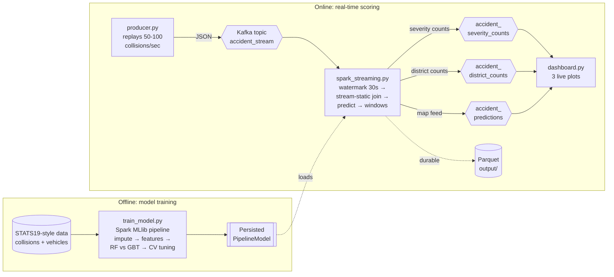

# Architecture

End-to-end flow from raw data to live dashboard.

## How the pieces line up

| Stage | Script | What it does |
|-------|--------|--------------|
| Train | `train_model.py` | Builds and tunes the severity model offline, saves it to `models/`. |
| Ingest | `producer.py` | Simulates a sensor feed, publishing collisions to Kafka each second. |
| Process | `spark_streaming.py` | Watermarks, joins vehicle features, scores severity, aggregates in tumbling windows, writes back to Kafka + Parquet. |
| Visualise | `dashboard.py` | Consumes the result topics and redraws three live panels. |

## Design decisions worth noting

- **Event-time + watermark.** Each record carries an `event_time`; a 30-second
  watermark bounds state and discards very-late events, so windowed counts stay
  correct without unbounded memory growth.
- **Stream-static join.** Vehicle features are a static table joined onto the
  live collision stream, keeping the model's feature set identical to training.
- **Parquet as a durability layer.** Aggregations are written to Parquet as well
  as Kafka, so results survive a dashboard restart and can be re-read as a batch.
- **One model, two runtimes.** The same persisted `PipelineModel` powers both
  the offline evaluation and the online scoring path — no feature-logic drift.
